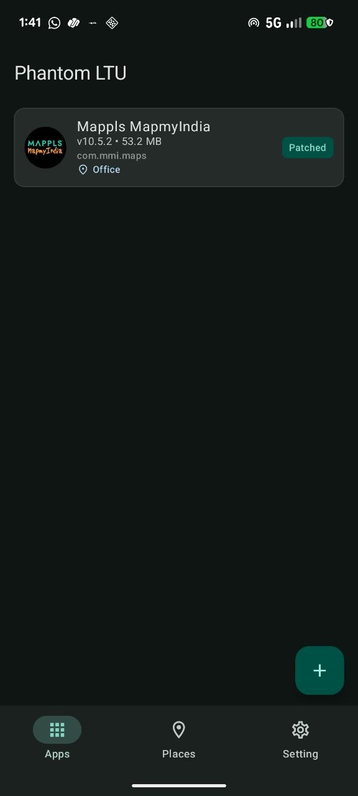
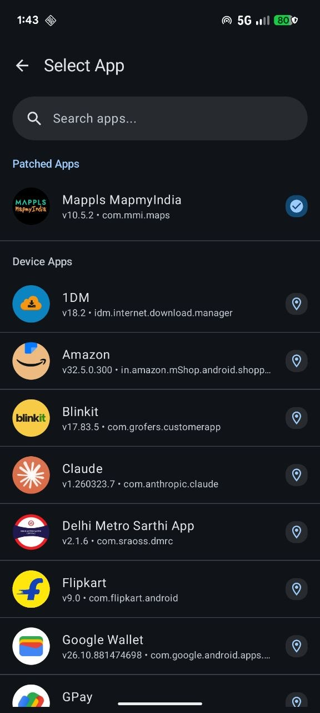
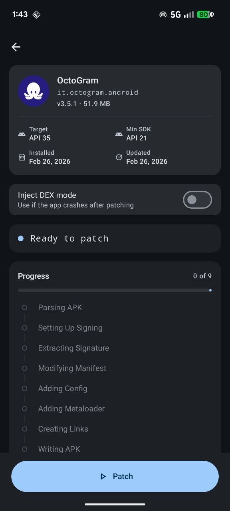
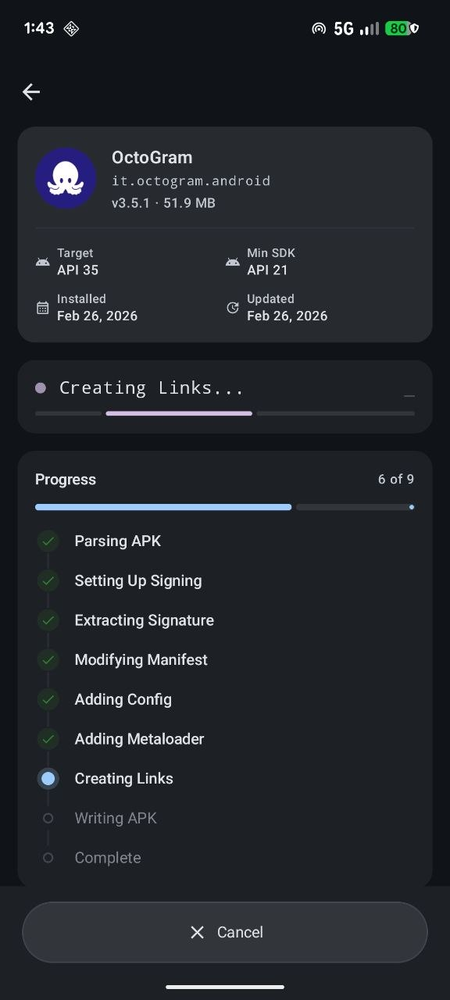
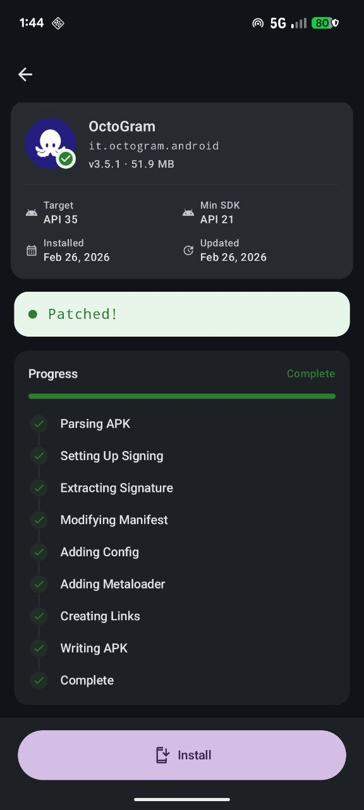
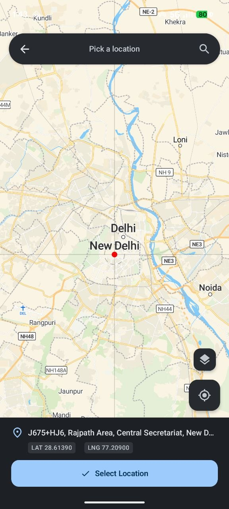
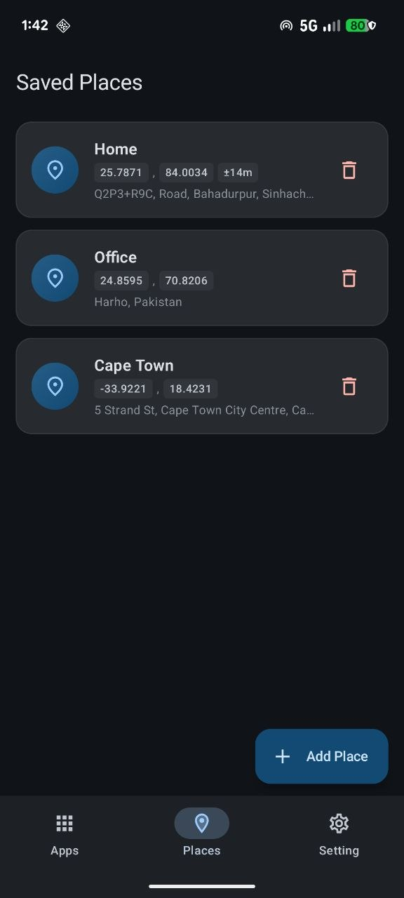
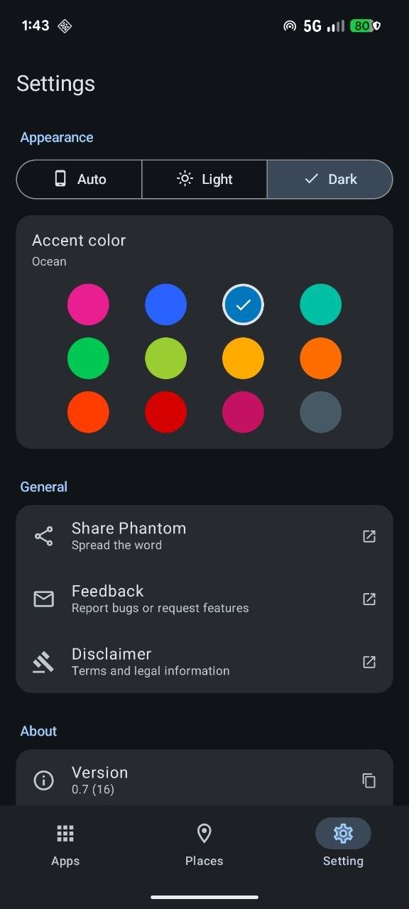

<p align="center">
  
  <h1 align="center">PhantomLTU</h1>
  <p align="center">
    Location Testing Utility for Android — no root required.
    <br />
    Patch any app to use custom GPS coordinates with a single tap.
  </p>
</p>

<p align="center">
  
  
  
  
</p>

---

## Features

**Patch & Spoof** — Select any installed app, patch it with location hooks, and assign custom GPS coordinates. The patched app sees your chosen location across all Android location APIs.

**Map Picker** — Interactive full-screen map with Google Maps tiles, search bar, satellite/street toggle, and crosshair targeting. Search by address, coordinates, or Google Maps URL. Tap to save locations with custom names.

**Saved Places** — Build a library of GPS locations. Assign any saved place to any patched app instantly. Each place stores coordinates, accuracy radius, and reverse-geocoded address.

**Per-App Control** — Each patched app gets its own location assignment. Switch between saved places or revert to real GPS on a per-app basis.

**Visual Patching Timeline** — Watch the multi-step patching process (parse, patch, install) with a clear timeline UI and color-coded status updates.

**Comprehensive Hooking** — Intercepts LocationManager, FusedLocationProviderClient, GNSS satellite data, WiFi scan results, and cell tower APIs. Includes realistic GPS jitter, satellite simulation, and anti-detection bypasses.

**Material You** — Dynamic color theming with seed color picker, dark/light/system mode, and Material 3 Expressive components throughout.

## Screenshots

<p align="center">
  
  
  
  
</p>
<p align="center">
  
  
  
  
</p>

## How It Works

PhantomLTU uses LSPatch technology to inject location hooks into target apps at the APK level:

```
 ┌─────────────┐     ┌─────────────┐     ┌─────────────┐     ┌─────────────┐
 │  1. Select  │────>│  2. Patch   │────>│ 3. Install  │────>│  4. Spoof   │
 │             │     │             │     │             │     │             │
 │ Pick an app │     │ Inject hook │     │ Install the │     │ Assign any  │
 │ from your   │     │ loader into │     │ patched APK │     │ saved place │
 │ device      │     │ the APK     │     │ on device   │     │ to the app  │
 └─────────────┘     └─────────────┘     └─────────────┘     └─────────────┘
```

Once patched, the app's location APIs are intercepted at runtime:

- **`LocationManager`** — `getLastKnownLocation`, `requestLocationUpdates`, `getCurrentLocation`, provider queries
- **`FusedLocationProviderClient`** — Google Play Services location (Tasks, LocationResult, LocationCallback)
- **`GnssStatus`** — Simulated satellite constellation with realistic PRN, elevation, azimuth, and SNR data
- **`TelephonyManager`** — Cell tower location queries blocked to prevent triangulation
- **`WifiManager`** — Scan results cleared to prevent WiFi-based positioning

All spoofed locations include micro-jitter, GPS noise, and realistic metadata to appear as genuine GPS fixes.

## Architecture

Clean Architecture with MVVM. Three layers — presentation depends on domain, domain has no dependencies, data implements domain interfaces.

```
┌─────────────────────────────────────────────────────────────┐
│                    Presentation Layer                       │
│  ┌─────────────┐  ┌─────────────┐  ┌─────────────┐         │
│  │   Screens   │  │  ViewModels │  │    State    │         │
│  │  (Compose)  │  │   (Logic)   │  │  (UiState)  │         │
│  └─────────────┘  └─────────────┘  └─────────────┘         │
├─────────────────────────────────────────────────────────────┤
│                      Domain Layer                           │
│  ┌─────────────┐  ┌─────────────┐  ┌─────────────┐         │
│  │   Models    │  │ Repositories│  │   Errors    │         │
│  │  (Domain)   │  │ (Interfaces)│  │  (Sealed)   │         │
│  └─────────────┘  └─────────────┘  └─────────────┘         │
├─────────────────────────────────────────────────────────────┤
│                       Data Layer                            │
│  ┌─────────────┐  ┌─────────────┐  ┌─────────────┐         │
│  │ DataSources │  │    DTOs     │  │   Mappers   │         │
│  │   (Local)   │  │  (Transfer) │  │ (DTO→Model) │         │
│  └─────────────┘  └─────────────┘  └─────────────┘         │
└─────────────────────────────────────────────────────────────┘
```

### Modules

| Module | Type | Purpose |
|--------|------|---------|
| `app` | Android App | UI (Compose), ViewModels, DI (Koin), Navigation |
| `patcher` | Pure JVM | APK patching engine — modifies APKs to inject bootstrap loader |
| `meta-loader` | Android Lib | Stub `AppComponentFactory` injected into patched APKs |
| `patch-loader` | Android Lib | Runtime hooks (Kotlin + C++) that intercept location APIs |
| `shared/java` | Pure JVM | Shared constants, config keys, DTOs |
| `shared/android` | Android Lib | Android-specific shared utilities |
| `core` | Android Lib | LSPosed core — Xposed method hooking framework |
| `apkzlib` | Java Lib | Google's APK manipulation library |

### Runtime Flow

```
App Launch (patched)
  │
  ├─ meta-loader (AppComponentFactory stub)
  │    └─ Locates PhantomLTU manager APK
  │    └─ Loads patch-loader DEX + libphantom.so
  │
  ├─ patch-loader (hooks + bypasses)
  │    ├─ Security bypasses (signature, debuggable, Xposed hiding)
  │    ├─ Location hooks (LocationManager, Fused, GNSS, WiFi, Telephony)
  │    └─ IPC to manager app for config (coordinates, accuracy, etc.)
  │
  └─ Manager app (PhantomLTU)
       └─ Serves location config via Binder IPC
```

## Tech Stack

| Category | Technology | Version |
|----------|------------|---------|
| Language | Kotlin | 2.3.0 |
| UI | Jetpack Compose | BOM 2025.12.01 |
| Design | Material 3 Expressive | Dynamic theming |
| Navigation | Navigation3 | 1.1.0-alpha01 |
| DI | Koin | 4.2.0 |
| Database | Room | 2.8.4 |
| Networking | Ktor | 3.3.3 |
| Maps | Leaflet.js + Google Maps tiles | 1.9.4 |
| Image Loading | Coil | 3.3.0 |
| Logging | Kermit | 2.0.8 |
| Serialization | kotlinx-serialization | 1.9.0 |
| Native | C++23 / CMake | NDK 29 |

## Building

### Requirements

- JDK 21+
- Android SDK 36
- NDK 29.0.13113456
### Commands

```bash
./gradlew assembleDebug       # Debug APK
./gradlew assembleRelease     # Release APK
./gradlew buildDebug          # Build + copy to out/debug/
./gradlew buildRelease        # Build + copy to out/release/
./gradlew test                # Unit tests
```

### Compatibility

| Property | Value |
|----------|-------|
| Min SDK | 28 (Android 9.0 Pie) |
| Target SDK | 36 |
| ABIs | arm64-v8a, armeabi-v7a, x86, x86_64 |

<details>
<summary><strong>Project Structure</strong></summary>

```
PhantomLTU/
├── app/src/main/java/com/navi/phantom/
│   ├── data/                       # Data layer (Room, DTOs, mappers)
│   ├── domain/                     # Domain layer (models, repo interfaces, errors)
│   ├── features/
│   │   ├── apps/                   # Patched app listing & selection
│   │   ├── patcher/                # APK patching workflow & timeline
│   │   ├── places/                 # Saved GPS locations
│   │   ├── map/                    # Map picker with search
│   │   ├── settings/               # Theme, about, feedback
│   │   └── disclaimer/             # Terms of use
│   ├── navigation/                 # Navigation3 destinations & routing
│   ├── components/                 # Shared UI components
│   ├── theme/                      # Material 3 theme
│   └── di/                         # Koin DI modules
├── patcher/                        # APK patching engine (pure JVM)
├── meta-loader/                    # Bootstrap loader injected into APKs
├── patch-loader/                   # Runtime hooks + native code (libphantom.so)
│   └── src/main/jni/               # C++ (signature bypass, DEX loading)
├── shared/
│   ├── java/                       # Shared constants & config keys
│   └── android/                    # Android-specific utilities
├── core/                           # LSPosed core (Xposed framework)
│   └── external/                   # Dobby, LSPlant, LSPatch, fmt
└── apkzlib/                        # APK manipulation library
```

</details>

## Disclaimer

This application is provided strictly for **educational, software testing, and application development purposes only**.

By using this software, you acknowledge and agree to the following:

1. **Intended Use** — This software is designed exclusively for developers and testers who need to simulate GPS coordinates for testing location-based features in their own applications.

2. **Prohibited Activities** — You shall NOT use this application to:
   - Falsify your location for attendance or work verification systems
   - Deceive any person, organization, or service
   - Violate any applicable local, state, national, or international law
   - Circumvent security measures of any third-party application
   - Engage in any form of fraud or misrepresentation

3. **No Warranty** — This software is provided "AS IS" without warranty of any kind. The developers make no guarantees regarding reliability, accuracy, or completeness.

4. **Liability** — You are solely responsible for your use of this application. The developers shall not be held liable for any misuse or any direct, indirect, incidental, special, or consequential damages arising from its use.

5. **Compliance** — You agree to comply with all applicable laws and regulations in your jurisdiction regarding the use of GPS spoofing software.

## License

This project is licensed under the [GNU Affero General Public License v3.0](LICENSE).
